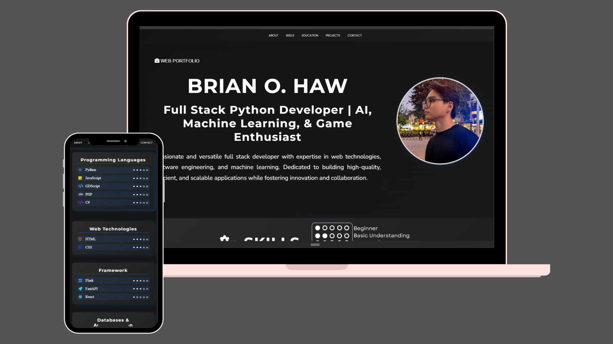

# 📌 Brian O. Haw - Portfolio

## Note 🙂‍↔📒: This is an outdated portfolio. 
Here is my current portfolio using react, typescript, and tailwindcss. 
Link: https://github.com/BrianShiroe/react-tailwindcss-portfolio.git
Live Demo: https://brianshiroe.netlify.app

Welcome to my personal portfolio! This website showcases my skills, projects, education, and contact information in an interactive and visually appealing way.

---
## 🌐 Live Demo
Link [brianshiroevanilla.netlify.app](https://brianshiroevanilla.netlify.app/)



---

## 📖 About the Portfolio
This portfolio is a fully responsive and animated website built using **HTML, CSS, and JavaScript**. It highlights my expertise in **game development, machine learning, web technologies, and software engineering**.

### 🛠️ Technologies Used
- **Frontend:** HTML, CSS, JavaScript
- **Animation:** CSS Animations, JavaScript Interactions
- **Icons & Fonts:** Google Fonts, Custom SVGs

---

## Getting Started

1. Clone repository
```bash
git clone https://github.com/BrianShiroe/portfolio-vanilla-html-css-javascript.git
```
2. Navigate to the project directory
```bash
cd portfolio-vanilla-html-css-javascript
```

### Show your support

If you like my portfolio, feel free to connect or give a ⭐ on the repository!
